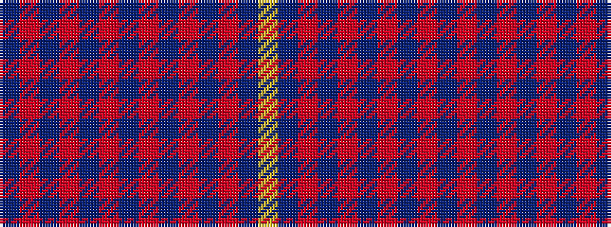

BRBRBRBRBRBRBY

It is a 14 stripe tartan.

<figure class="pat-woven">

<figcaption>idealised sample</figcaption>
</figure>

## Colour Sequence



## Tartans with this colour sequence

| Tartans |
|---------------|
| [Abaco Loyalist](/setts/s14/n60r2n2r6n1r2n1r6n1r2n1r6n2lr2~x2/)|
||
