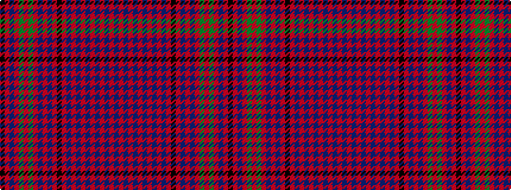

BRBRBRBRBRBRKRBRBRGRGRBRK

It is a 25 stripe tartan.

<figure class="pat-woven">

<figcaption>idealised sample</figcaption>
</figure>

## Colour Sequence



## Tartans with this colour sequence

| Tartans |
|---------------|
| [Murray of Tullibardine #4](/variants/s25/db6r5db4r3db6r4db4r5db9r5db4r3k8r3db4r36db27r4dg4r14dg27r9db6r6k3/)|
||
| [Murray of Tullibardine 5](/variants/s25/db6r5db4r3db6r4db4r5db9r5db4r3k8r3db4r36db27r4g4r14g27r9db6r6k3/)|
||
