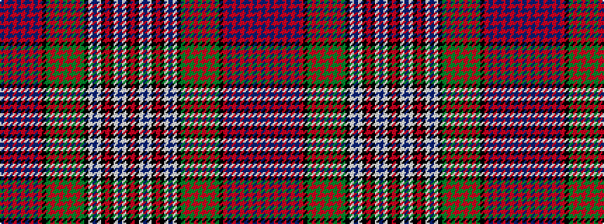

BRBRBRBRBRKGRGRGRGRGKWBWKRKWBWKR

It is a 32 stripe tartan.

<figure class="pat-woven">

<figcaption>idealised sample</figcaption>
</figure>

## Colour Sequence



## Tartans with this colour sequence

| Tartans |
|---------------|
| [MacDonald Dress](/variants/s32/db12r3db2r1db8r1db2r3db12r1k12g12r3g2r1g8r1g2r3g12k12w2db4w16k1r4k1w16db4w2k12r1~x2/)|
||
