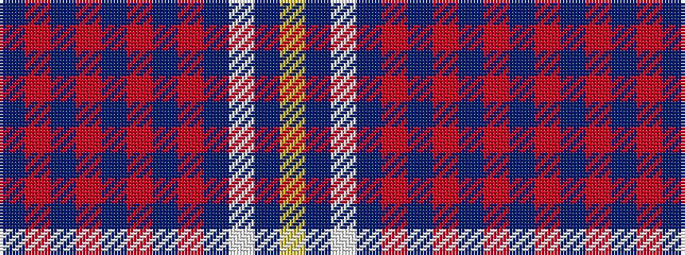

BRBRBRBRBWBY

It is a 12 stripe tartan.

<figure class="pat-woven">

<figcaption>idealised sample</figcaption>
</figure>

## Colour Sequence



## Tartans with this colour sequence

| Tartans |
|---------------|
| [Kirkcaldy Tartan Army (Corporate)](/setts/s12/dt36r3dt1r2dt3r6db1r2db35w1db1lo2~x2/)|
||
