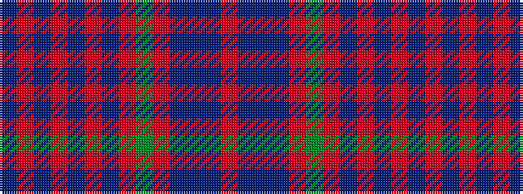

BRBRBRBRGRBBBR

It is a 14 stripe tartan.

<figure class="pat-woven">

<figcaption>idealised sample</figcaption>
</figure>

## Colour Sequence



## Tartans with this colour sequence

| Tartans |
|---------------|
| [Minster](/variants/s14/dbi6ri2db2ri3db3ri18dbi16ri2g18r2dbi3t3dbi2ri6~x2/)|
||
