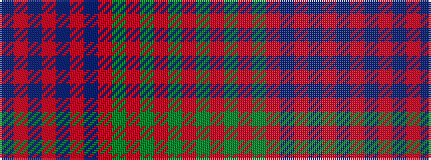

BRBRBRBRGRGRGR

It is a 14 stripe tartan.

<figure class="pat-woven">

<figcaption>idealised sample</figcaption>
</figure>

## Colour Sequence



## Tartans with this colour sequence

| Tartans |
|---------------|
| [Ross #2](/setts/s14/r3dg12r2dg1r1dg1r4db3r1db3r28db1r3db2~x2/)|
||
| [Ross 5](/setts/s14/r3g12r2g1r1g1r4db3r1db3r28db1r3db2~x2/)|
||
| [Ross, Old](/setts/s14/dp2r1dp1r31dp8r2dp8r3g1r2g1r3g5r2~x2/)|
||
