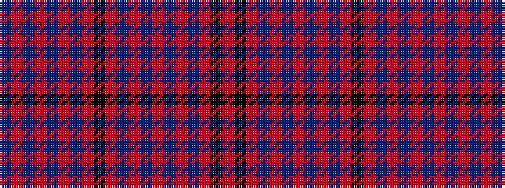

BRBRBRBRKRBRBRBRBRKR

It is a 20 stripe tartan.

<figure class="pat-woven">

<figcaption>idealised sample</figcaption>
</figure>

## Colour Sequence



## Tartans with this colour sequence

| Tartans |
|---------------|
| [Glen Burns (WCWM - 1)](/setts/s20/o10k1o7n4oi7n1oi7n1oi7n4o6k1o6n4oi7n1oi2n1oi7n7~x4/)|
||
