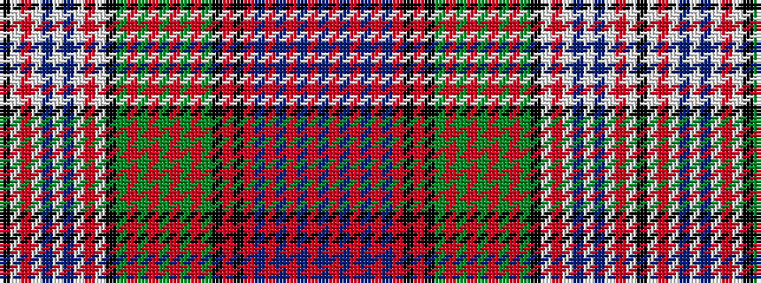

BRBRBRBRKRKGRGRGRGRGKWRWBWBWRWK

It is a 31 stripe tartan.

<figure class="pat-woven">

<figcaption>idealised sample</figcaption>
</figure>

## Colour Sequence



## Tartans with this colour sequence

| Tartans |
|---------------|
| [MacDonald Dress #3](/setts/s31/k4w2r1w7b3w23b3w7r1w2k4dg4r1dg1r1dg1r1dg1r1dg4k4r1k4r1db1r1db1r1db1r1db4~x2/)|
||
| [MacDonald Dress Clan Tartan Tartan Number: 2001. Earliest known date: pre 2003 Estimated count See products available Copyright © Blair Urquhart, Comrie, 2015](/setts/s31/k4w2r1w7t3w23t3w7r1w2k4g4r1g1r1g1r1g1r1g4k4r1k4r1db1r1db1r1db1r1db4~x2/)|
||
| [MacDonald, dress](/setts/s31/k4w2r1w7b3w23b3w7r1w2k4g4r1g1r1g1r1g1r1g4k4r1k4r1db1r1db1r1db1r1db4~x2/)|
||
