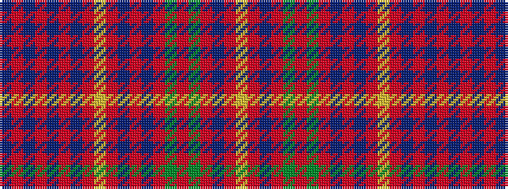

BRBRBRBRYRBRBRGRGRBRY

It is a 21 stripe tartan.

<figure class="pat-woven">

<figcaption>idealised sample</figcaption>
</figure>

## Colour Sequence



## Tartans with this colour sequence

| Tartans |
|---------------|
| [MacLeod Red](/setts/s21/db4r1db1r2db11r2db1r1ly1r1db1r16db8r4g4r16g11r8db4r2ly2~x2/)|
||
