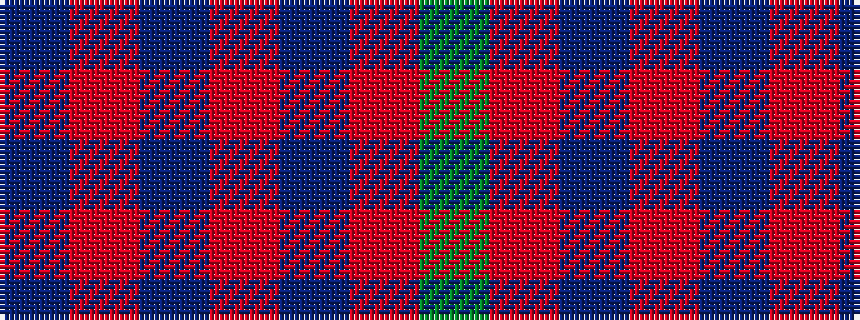

BRBRBRG

It is a 7 stripe tartan.

<figure class="pat-woven">

<figcaption>idealised sample</figcaption>
</figure>

## Colour Sequence



## Tartans with this colour sequence

| Tartans |
|---------------|
| [Hebridean, (Old..)](/setts/s7/db10r1db10r2db10r1g2~x2/)|
||
