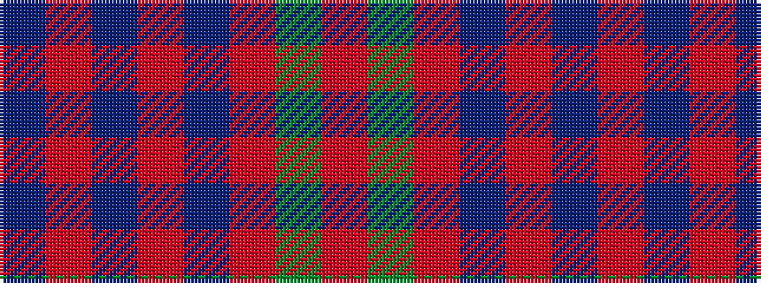

BRBRBRGR

It is a 8 stripe tartan.

<figure class="pat-woven">

<figcaption>idealised sample</figcaption>
</figure>

## Colour Sequence



## Tartans with this colour sequence

| Tartans |
|---------------|
| [Franklin Museum Unidentified 2](/setts/s8/r5g20r25db1r25db20r5db1~x4/)|
||
| [Gammell (Personal)](/setts/s8/t32r3t3r3t3r10g24r3~x2/)|
||
