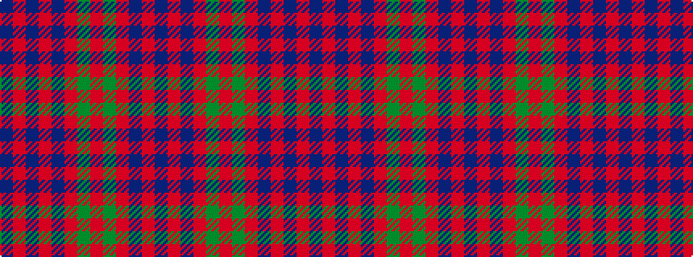

BRBRBRGRGRBRB

It is a 13 stripe tartan.

<figure class="pat-woven">

<figcaption>idealised sample</figcaption>
</figure>

## Colour Sequence



## Tartans with this colour sequence

| Tartans |
|---------------|
| [Black Watch (Band Plaid)](/variants/s13/db16r4db4r4db4r29g27r4g27r29db26r4db4~x2/)|
||
| [Tyneside, Scottish](/variants/s13/db11o1db1o1db1o8g8o1g8o8db8o1db1~x2/)|
||
