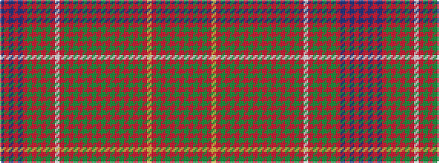

BRBRBRGRGRGRWRGRGRGRGRGRGRGRGRGRYRGRGRGR

It is a 40 stripe tartan.

<figure class="pat-woven">

<figcaption>idealised sample</figcaption>
</figure>

## Colour Sequence



## Tartans with this colour sequence

| Tartans |
|---------------|
| [MacRae of Inverinate](/setts/s40/r23dg2r3dg2r3dg2r5ly5r5dg2r3dg2r3dg2r23dg23r5dg15r5dg23r23dg2r3dg2r3dg2r5w5r5dg2r3dg2r3dg2r23dp15r5dp15r5dp15~x2/)|
||
| [MacRae of Inverinate](/setts/s40/r23g2r3g2r3g2r5ly5r5g2r3g2r3g2r23g23r5g15r5g23r23g2r3g2r3g2r5w5r5g2r3g2r3g2r23db15r5db15r5db15~x2/)|
||
