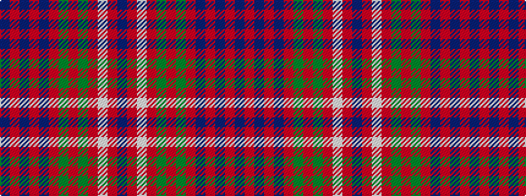

BRBRBRGRGRWRB

It is a 13 stripe tartan.

<figure class="pat-woven">

<figcaption>idealised sample</figcaption>
</figure>

## Colour Sequence



## Tartans with this colour sequence

| Tartans |
|---------------|
| [Cameron of Locheil](/variants/s13/db4r1db1r18db10r1dg1r6dg10r6w1r4db1~x2/)|
||
| [Cameron of Locheil](/variants/s13/db4r1db1r18db10r1g1r6g10r6w1r4db1~x2/)|
||
