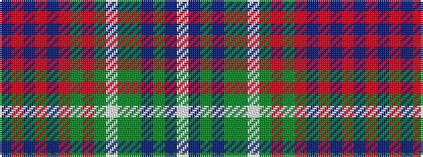

BRBRBRGRGWGGBGBW

It is a 16 stripe tartan.

<figure class="pat-woven">

<figcaption>idealised sample</figcaption>
</figure>

## Colour Sequence



## Tartans with this colour sequence

| Tartans |
|---------------|
| [Haughey (Personal)](/variants/s16/db6r2db2r4db14r2dg12r2dg3w2dg3dy11dp9dg2dp6w2~x2/)|
||
