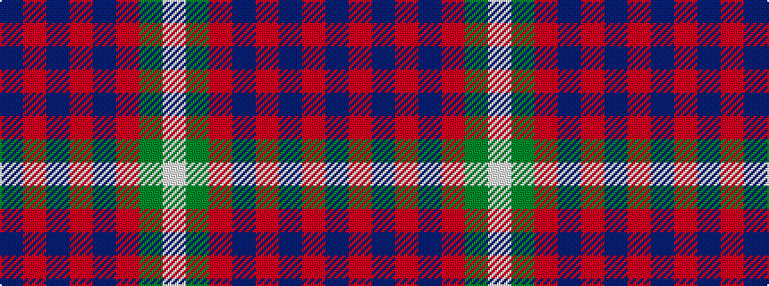

BRBRBRGW

It is a 8 stripe tartan.

<figure class="pat-woven">

<figcaption>idealised sample</figcaption>
</figure>

## Colour Sequence



## Tartans with this colour sequence

| Tartans |
|---------------|
| [Lamont](/variants/s8/p11o2p2o2p2o11g14w2~x2/)|
||
