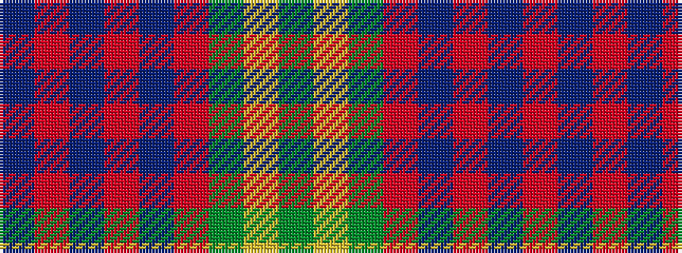

BRBRBRGYG

It is a 9 stripe tartan.

<figure class="pat-woven">

<figcaption>idealised sample</figcaption>
</figure>

## Colour Sequence



## Tartans with this colour sequence

| Tartans |
|---------------|
| [Dewar, Christian (Personal)](/variants/s9/db16r2db2r2db2r6dg13lo2dg3~x2/)|
||
| [Durie (Clan)](/variants/s9/db12r1db1r1db1r4g12ly1g2~x4/)|
||
