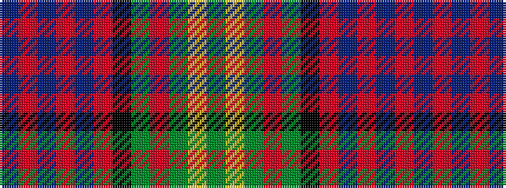

BRBRBRKGRGYG

It is a 12 stripe tartan.

<figure class="pat-woven">

<figcaption>idealised sample</figcaption>
</figure>

## Colour Sequence



## Tartans with this colour sequence

| Tartans |
|---------------|
| [Bowie](/setts/s12/db9r3db3r5db16r2k17g16r5g3ly1g9~x2/)|
||
| [Bowie (Lochcarron)](/setts/s12/dg10lo2dg3r4dg13k13r2b13r4b3r2b10~x2/)|
||
