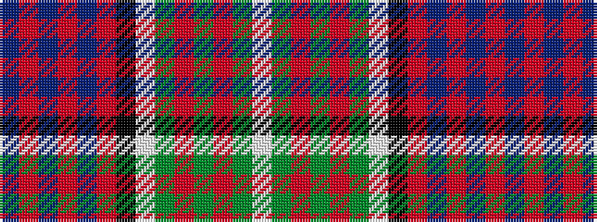

BRBRBRKWGRGRGW

It is a 14 stripe tartan.

<figure class="pat-woven">

<figcaption>idealised sample</figcaption>
</figure>

## Colour Sequence



## Tartans with this colour sequence

| Tartans |
|---------------|
| [MacDonald of Clanranald #4](/setts/s14/db20r2db3r6db32r2k32w2dg30r6dg4r2dg4w1~x2/)|
||
| [MacDonald of Clanranald #5](/setts/s14/db20r2db2r5db30r2k32w2dg30r5dg4r2dg4w2/)|
||
| [MacDonald of Clanranald 3](/setts/s14/db20r2db3r6db32r2k32w2g30r6g4r2g4w1~x2/)|
||
