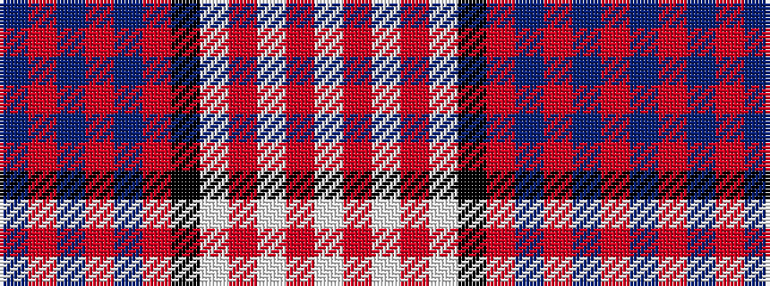

BRBRBRKWRWRW

It is a 12 stripe tartan.

<figure class="pat-woven">

<figcaption>idealised sample</figcaption>
</figure>

## Colour Sequence



## Tartans with this colour sequence

| Tartans |
|---------------|
| [MacDonald Dress (Irish)](/variants/s12/db17r42db2r5db29r2k31w29r5w2r2w17/)|
||
| [MacDonald Pattern of Plaids](/variants/s12/db16r4db6r10db30r4k30w34r9w6r4w16/)|
||
