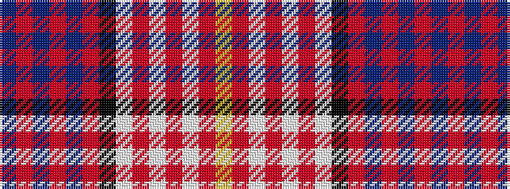

BRBRBRKWRWRWRY

It is a 14 stripe tartan.

<figure class="pat-woven">

<figcaption>idealised sample</figcaption>
</figure>

## Colour Sequence



## Tartans with this colour sequence

| Tartans |
|---------------|
| [Carnegie #2](/variants/s14/db10r2db2r4db12r2k14w13r4w2r2w4r1ly3~x2/)|
||
