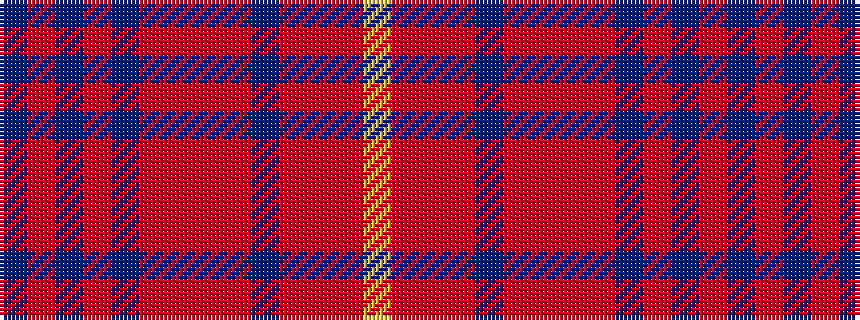

BRBRBRRRRBRRRY

It is a 14 stripe tartan.

<figure class="pat-woven">

<figcaption>idealised sample</figcaption>
</figure>

## Colour Sequence



## Tartans with this colour sequence

| Tartans |
|---------------|
| [Kinloch Anderson Rowanberry](/setts/s14/ly7r30r4r8dr4ri12r6ri12m28dr4m8dr8m8dr4/)|
||
