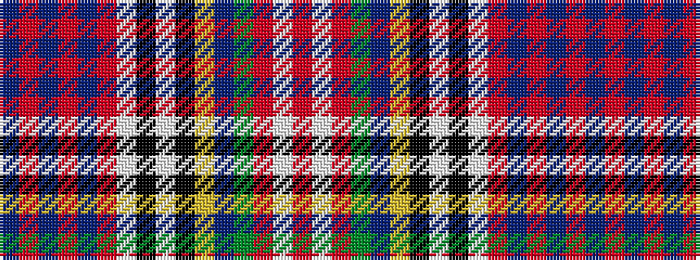

BRBRBRWKWKYBGRWR

It is a 16 stripe tartan.

<figure class="pat-woven">

<figcaption>idealised sample</figcaption>
</figure>

## Colour Sequence



## Tartans with this colour sequence

| Tartans |
|---------------|
| [Royal Stewart, (Variant)](/variants/s16/db81r4db8r8db4r12w16k8w32k16ly6db8g16r8w4r24/)|
||
| [Royal Stuart/Stewart (Variant)](/variants/s16/db81r4db8r8db4r12w16k8w32k16ly6db8dg16r8w4r24/)|
||
