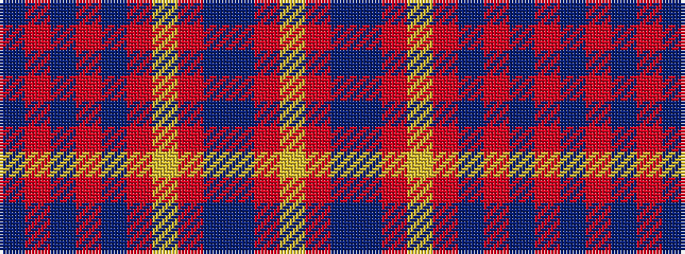

BRBRBRYRBBRY

It is a 12 stripe tartan.

<figure class="pat-woven">

<figcaption>idealised sample</figcaption>
</figure>

## Colour Sequence



## Tartans with this colour sequence

| Tartans |
|---------------|
| [Spirit of Dunkeld (Fashion)](/setts/s12/t38r1t2r2t2r6lo4r10db8t11r3lo1~x2/)|
||
