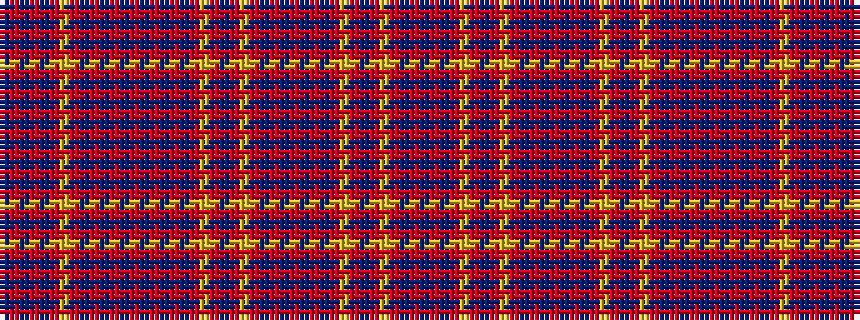

BRBRBRYRBRBRBRBRBRBRYRBRYRBRBRBRBRYRBRYRBRB

It is a 43 stripe tartan.

<figure class="pat-woven">

<figcaption>idealised sample</figcaption>
</figure>

## Colour Sequence



## Tartans with this colour sequence

| Tartans |
|---------------|
| [Culloden Unidentified Plaid](/variants/s43/db5r7db1r1ly5r5db5r5ly2r1db1r1db1r5db1r1db1r1ly2r5db5r5ly5r1db1r6db1r1db1r2db1r1db1r6db1r1ly5r4db1r1db1r1db5~x2/)|
||
