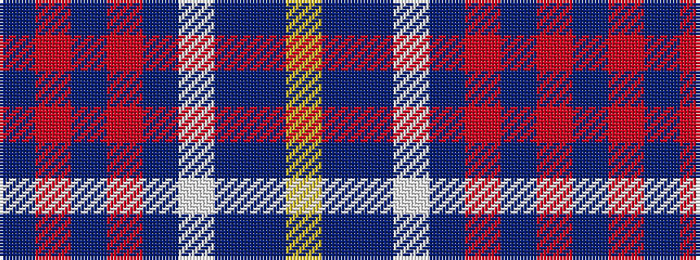

BRBRBWBBY

It is a 9 stripe tartan.

<figure class="pat-woven">

<figcaption>idealised sample</figcaption>
</figure>

## Colour Sequence



## Tartans with this colour sequence

| Tartans |
|---------------|
| [Telfer, Brian William (Personal)](/variants/s9/db3r13db13r9db5w2dp9db21ly2~x2/)|
||
