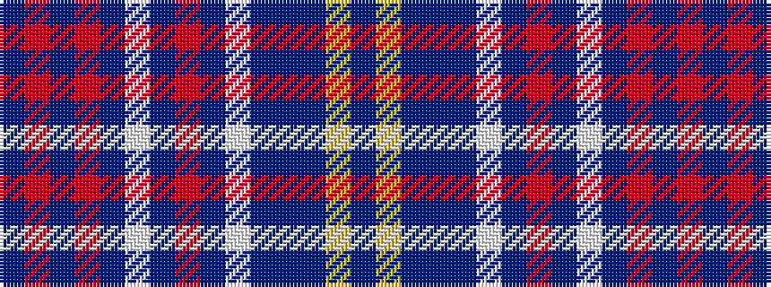

BRBRBWBRBWBBBYB

It is a 15 stripe tartan.

<figure class="pat-woven">

<figcaption>idealised sample</figcaption>
</figure>

## Colour Sequence



## Tartans with this colour sequence

| Tartans |
|---------------|
| [Federal Memorial](/variants/s15/db3r1db1r1db15w1db1r4db1w1db1t15db1ly1db3~x4/)|
||
