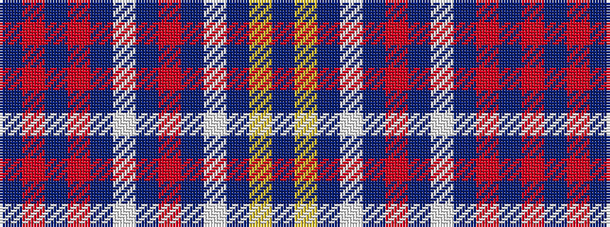

BRBRBWBRBWBYB

It is a 13 stripe tartan.

<figure class="pat-woven">

<figcaption>idealised sample</figcaption>
</figure>

## Colour Sequence



## Tartans with this colour sequence

| Tartans |
|---------------|
| [Federal Memorial Dress (Military)](/setts/s13/db3ly1t1w15t1r4t1w1t15r1t1r1t3~x4/)|
||
