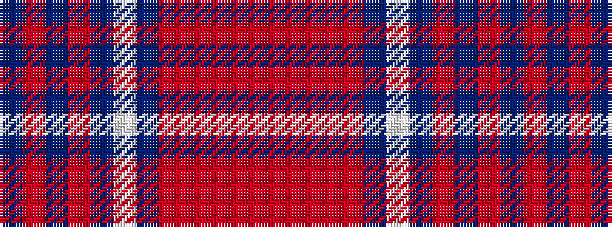

BRBRBWBRRRRR

It is a 12 stripe tartan.

<figure class="pat-woven">

<figcaption>idealised sample</figcaption>
</figure>

## Colour Sequence



## Tartans with this colour sequence

| Tartans |
|---------------|
| [Shieldhall (Fashion)](/setts/s12/do12r1do2r1do2lb2do3o9r1o2r1o3~x4/)|
||
