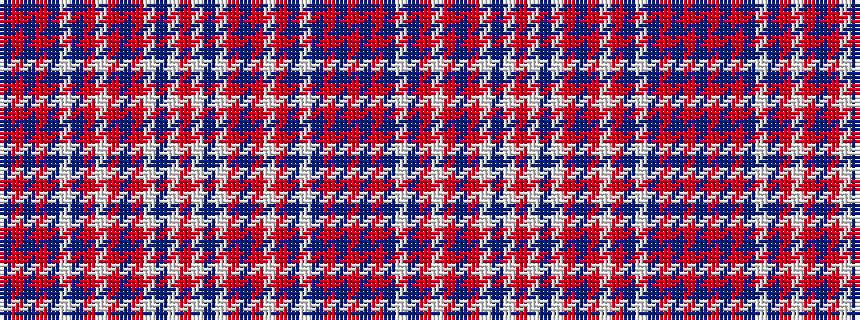

BRBRBWBRWRBRWBWRWBWRBRWRBWBRBR

It is a 30 stripe tartan.

<figure class="pat-woven">

<figcaption>idealised sample</figcaption>
</figure>

## Colour Sequence



## Tartans with this colour sequence

| Tartans |
|---------------|
| [Skye Dress Red, Earl of (Dance)](/setts/s30/dp4r2n4r2dp4w3dp3r2w4r2dp4r14w22dp2w5r4~x2/)|
||
