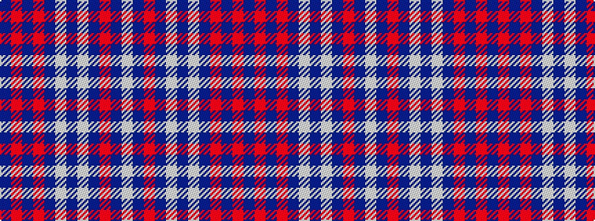

BRBRBWBWBRBW

It is a 12 stripe tartan.

<figure class="pat-woven">

<figcaption>idealised sample</figcaption>
</figure>

## Colour Sequence



## Tartans with this colour sequence

| Tartans |
|---------------|
| [Chrysanthemum (Japanese Four Seasons)](/variants/s12/w5dr1r20dr4w2dr4w2dr24o2dr1o4dr4~x2/)|
||
