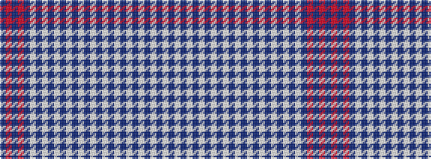

BRBRBWBWBWBWBWBWBWBWBWBWBWBW

It is a 28 stripe tartan.

<figure class="pat-woven">

<figcaption>idealised sample</figcaption>
</figure>

## Colour Sequence



## Tartans with this colour sequence

| Tartans |
|---------------|
| [Kilnsey (Fashion)](/variants/s28/db1o2db2o1db32w1db1w1db1w1db1w1db1w1db1w1db1w1db1w1db1w1db1w1db1w1db1w1~x2/)|
||
