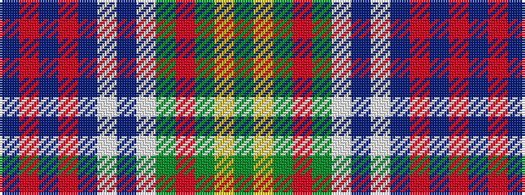

BRBRBWBWGRGYG

It is a 13 stripe tartan.

<figure class="pat-woven">

<figcaption>idealised sample</figcaption>
</figure>

## Colour Sequence



## Tartans with this colour sequence

| Tartans |
|---------------|
| [Bowie (Dalgety) Family Tartan](/variants/s13/db8r2db3r4db13w2dr13w2g13r4g4ly2g8~x2/)|
||
