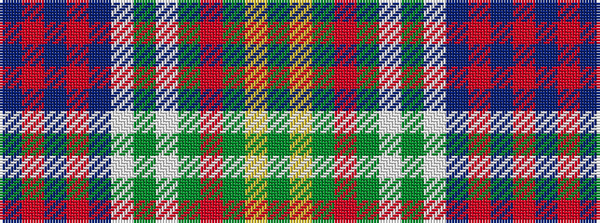

BRBRBWGWGRGYG

It is a 13 stripe tartan.

<figure class="pat-woven">

<figcaption>idealised sample</figcaption>
</figure>

## Colour Sequence



## Tartans with this colour sequence

| Tartans |
|---------------|
| [Bowie (white lines) (Name)](/setts/s13/dg8lo2dg4r4dg13w2y13w2db13r4db3r2db8~x2/)|
||
