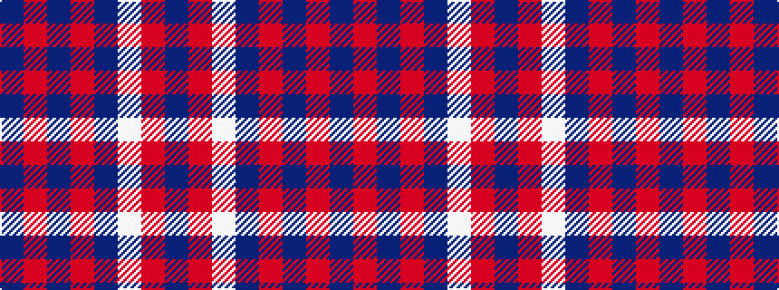

BRBRBWRB

It is a 8 stripe tartan.

<figure class="pat-woven">

<figcaption>idealised sample</figcaption>
</figure>

## Colour Sequence



## Tartans with this colour sequence

| Tartans |
|---------------|
| [Embrace, The](/variants/s8/db10r24db4r3db24w2r6db6~x2/)|
||
| [Orkney Slate (Fashion)](/variants/s8/n8o74lb8n42o11dp2o16n4/)|
||
