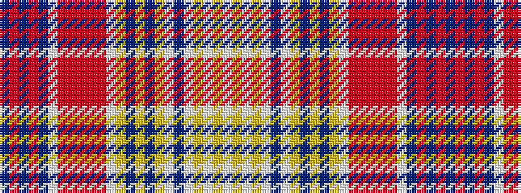

BRBRBWRRRRRWYBYBYWBWYWYW

It is a 24 stripe tartan.

<figure class="pat-woven">

<figcaption>idealised sample</figcaption>
</figure>

## Colour Sequence



## Tartans with this colour sequence

| Tartans |
|---------------|
| [Oriflame](/setts/s24/w4lo6w6lr21w9n27w10lr1n1lr5n1lr1w10m1r1m5r1m1w10n1m1n5m1n1~x2/)|
||
