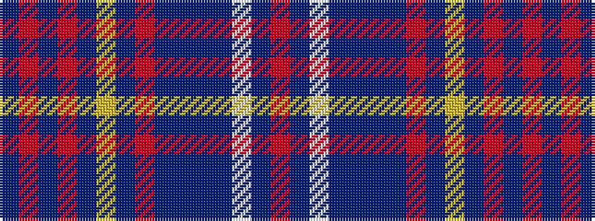

BRBRBYBRBBBBWBR

It is a 15 stripe tartan.

<figure class="pat-woven">

<figcaption>idealised sample</figcaption>
</figure>

## Colour Sequence



## Tartans with this colour sequence

| Tartans |
|---------------|
| [Royal Caledonian Curling Club](/setts/s15/dt72ri2dt2ri5dt4lo2dt4ri5dt2dti2dt2dti15lb2dti3r2~x2/)|
||
