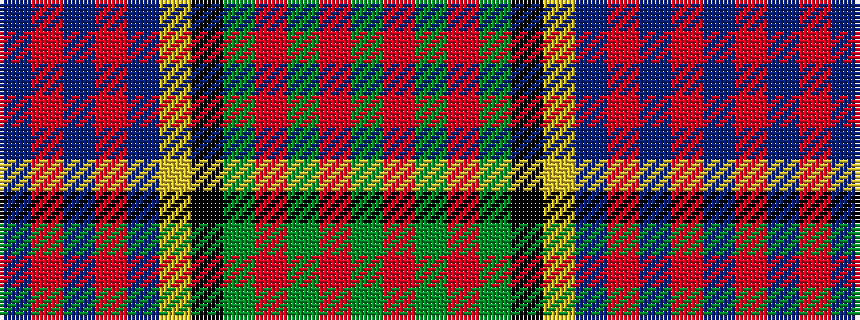

BRBRBYKGRGRG

It is a 12 stripe tartan.

<figure class="pat-woven">

<figcaption>idealised sample</figcaption>
</figure>

## Colour Sequence



## Tartans with this colour sequence

| Tartans |
|---------------|
| [Macallan Distillery](/variants/s12/g8r1g2r3g12k12ly1t12r3t2r1t8~x2/)|
||
