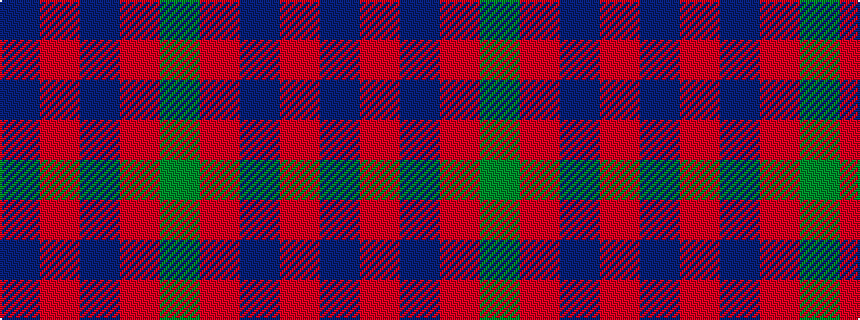

BRBRG

It is a 5 stripe tartan.

<figure class="pat-woven">

<figcaption>idealised sample</figcaption>
</figure>

## Colour Sequence



## Tartans with this colour sequence

| Tartans |
|---------------|
| [Ballindalloch Check](/variants/s5/dr1o1dr1o1dg1~x8/)|
||
