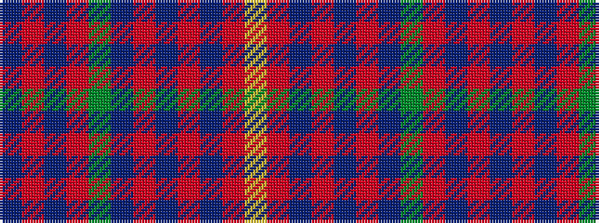

BRBRGBRBRBRY

It is a 12 stripe tartan.

<figure class="pat-woven">

<figcaption>idealised sample</figcaption>
</figure>

## Colour Sequence



## Tartans with this colour sequence

| Tartans |
|---------------|
| [Scobie (Name)](/setts/s12/dp1r1dp1r6g26dp14r20t1r1t1r2lr1~x2/)|
||
