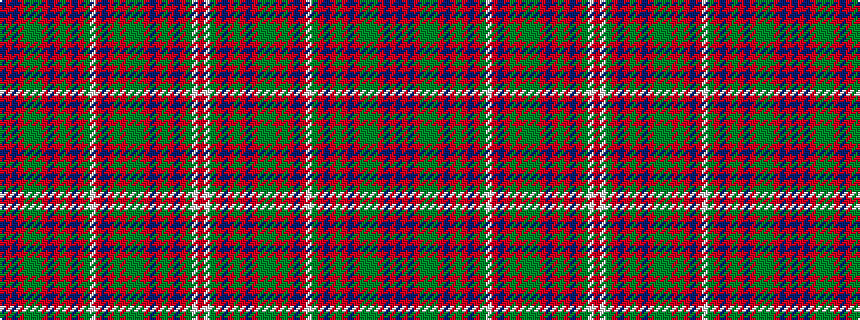

BRBRGGGRBRGRBRGWRBRGRGGGRBRGRBRGWR

It is a 34 stripe tartan.

<figure class="pat-woven">

<figcaption>idealised sample</figcaption>
</figure>

## Colour Sequence



## Tartans with this colour sequence

This pattern is a design lineage: every tartan below shares one colour order, whatever its owner —
near-identical designs are grouped, the largest lineage first (#112: the pattern is a tartan's
second parent, beside its family or clan).

<table class="sett-table">
<tbody>
<tr><td><a href="/variants/s34/db19r2db2r20g2y1g2r2db18r2g3r2db2r22g3w1r3db17r2g2r24g2y1g2r2db19r3g3r2db2r21g3w1r3~x2/">Unidentified 18th Centuary plain weave</a></td></tr>
<tr><td class="sett-swatch"></td></tr>
</tbody>
</table>

