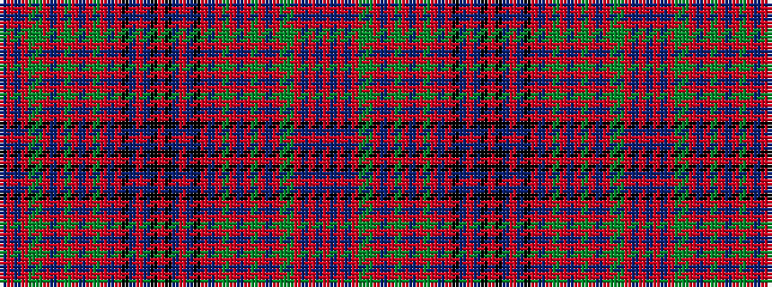

BRBRGGRBRGRBRGRBRKBRBKRKBRBKRBRGRBRGRBRGGRBRBR

It is a 46 stripe tartan.

<figure class="pat-woven">

<figcaption>idealised sample</figcaption>
</figure>

## Colour Sequence



## Tartans with this colour sequence

| Tartans |
|---------------|
| [Hebrides, Inner #02](/setts/s46/r47dbi3r1dbi3r11dg4g4r5dbi2r1g4r1dbi2r5g4r4db8r1k2dbi4r1dbi4k2r23~x2/)|
||
