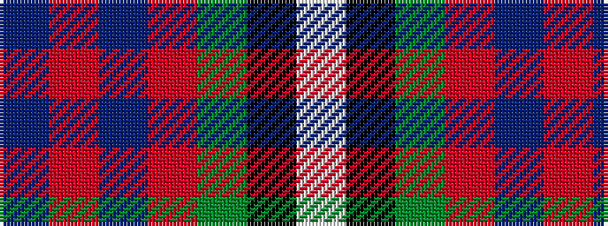

BRBRGKW

It is a 7 stripe tartan.

<figure class="pat-woven">

<figcaption>idealised sample</figcaption>
</figure>

## Colour Sequence



## Tartans with this colour sequence

| Tartans |
|---------------|
| [Chestico](/variants/s7/db20o1db1o1dg8k1w3~x2/)|
||
