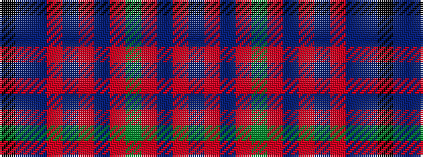

BRBRGRBRBRBBK

It is a 13 stripe tartan.

<figure class="pat-woven">

<figcaption>idealised sample</figcaption>
</figure>

## Colour Sequence



## Tartans with this colour sequence

| Tartans |
|---------------|
| [MacGillivray](/variants/s13/k6t1p1r57t2r2p23r4g30r6t1r6p2~x2/)|
||
| [MacGillivray #2](/variants/s13/k6t1dp1r57t2r2dp23r4dg30r6t1r6dp2~x2/)|
||
