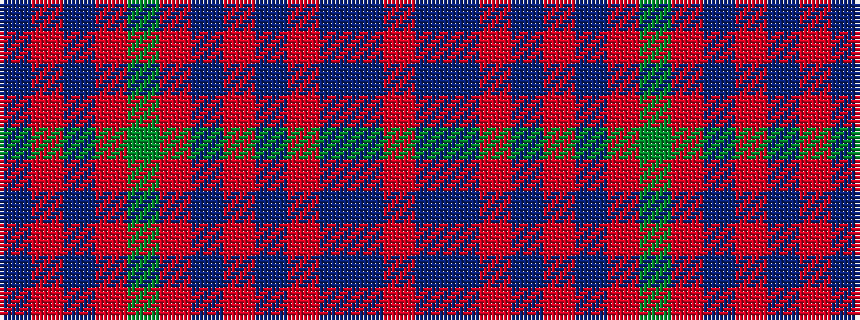

BRBRGRBRBRBBR

It is a 13 stripe tartan.

<figure class="pat-woven">

<figcaption>idealised sample</figcaption>
</figure>

## Colour Sequence



## Tartans with this colour sequence

| Tartans |
|---------------|
| [MacGillivray](/setts/s13/r6t1db1r57t2r2db23r4g30r6t1r6db2~x2/)|
||
| [MacGillivray](/setts/s13/r4t1db1r32t2r2db12r2g16r4t1r4db2~x2/)|
||
| [MacGillivray](/setts/s13/r4b1db1r32b2r2db12r2dg16r4b1r4db2~x2/)|
||
| [MacGillivray](/setts/s13/r4b1db1r32b2r2db12r2dg16r4b1r4db2/)|
||
| [MacGillivray - 1819 (Clan)](/setts/s13/r6t1dt1r57t2r2dt23r4g30r6t1r6dt2~x2/)|
||
