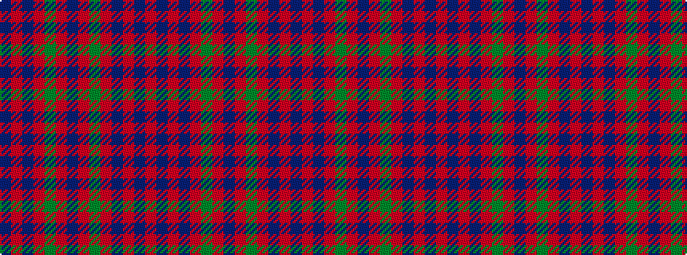

BRBRGRBRGRBRBR

It is a 14 stripe tartan.

<figure class="pat-woven">

<figcaption>idealised sample</figcaption>
</figure>

## Colour Sequence



## Tartans with this colour sequence

This pattern is a design lineage: every tartan below shares one colour order, whatever its owner —
near-identical designs are grouped, the largest lineage first (#112: the pattern is a tartan's
second parent, beside its family or clan).

<table class="sett-table">
<tbody>
<tr><td><a href="/variants/s14/db6r8db1r2y5r5db5r5y1r2db1r2db1r6~x2/">Munro (Culloden)</a></td></tr>
<tr><td class="sett-swatch"></td></tr>
<tr><td><a href="/variants/s14/db12r16db2r4y10r10db10r10y2r4db2r4db1r12/">Munro Old Artifact Tartan</a></td></tr>
<tr><td class="sett-swatch"></td></tr>
</tbody>
</table>

