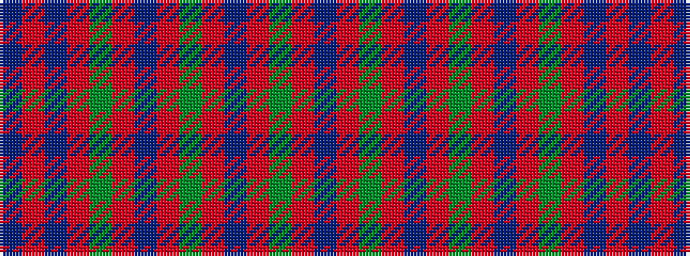

BRBRGRBRGRBRGRB

It is a 15 stripe tartan.

<figure class="pat-woven">

<figcaption>idealised sample</figcaption>
</figure>

## Colour Sequence



## Tartans with this colour sequence

| Tartans |
|---------------|
| [Glen Orchy](/setts/s15/t2r3db3r5g14r3db2r5g2r3db14r5g3r3t2~x2/)|
||
| [Glen Orchy #1](/setts/s15/t2r3dg3r5db14r3dg2r5db2r3dg14r5db3r3t2~x2/)|
||
| [MacIntyre](/setts/s15/b1r2dg2r4db16r2dg1r4db1r2dg16r4db2r2b1~x2/)|
||
| [MacIntyre](/setts/s15/b1r2dg2r4db16r2dg1r4db1r2dg16r4db2r2b1/)|
||
| [MacIntyre (of Gatehouse)](/setts/s15/t3r24db4r8g32r4db4r8g4r4db32r8g4r4t2~x2/)|
||
| [MacIntyre of Glenorchy Clan Tartan Tartan Number: 402. Earliest known date: 1850 Smiths' version is also known as MacIntyre of Whitehouse. Though different from the sett recorded by Lord Lyon it is the one most often available in modern times. Before moving to Badenoch to take protection for Clan Chattan, the MacIntyres were listed as followers of Stewart of Appin. See products available Copyright © Blair Urquhart, Comrie, 2015](/setts/s15/t1r1db1r2g8r1db1r2g1r1db8r2g1r1t1~x4/)|
||
| [MacIntyre of Whitehouse (Clan?)](/setts/s15/t1r2db2r4g16r2db2r4g2r2db16r4g2r2t1~x2/)|
||
| [MacIntyre, and Glenorchy](/setts/s15/t1r2db2r4g16r2db1r4g1r2db16r4g2r2t1~x2/)|
||
