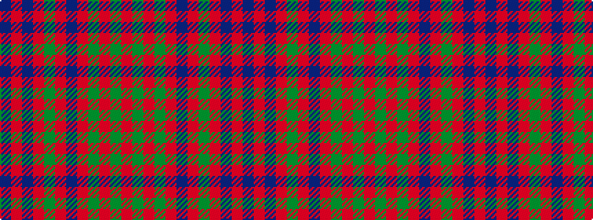

BRBRGRBRGRGR

It is a 12 stripe tartan.

<figure class="pat-woven">

<figcaption>idealised sample</figcaption>
</figure>

## Colour Sequence



## Tartans with this colour sequence

| Tartans |
|---------------|
| [Robertson #5](/variants/s12/r28dg2r5dg2r28db3r3dg24r3db24r3db3~x2/)|
||
