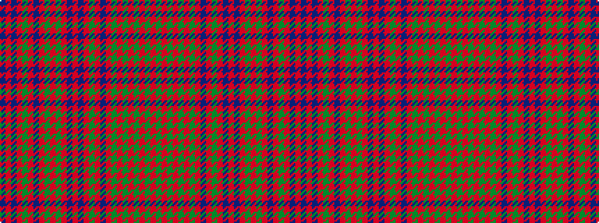

BRBRGRBRGRGRBRBRGRBRGRGRGRGR

It is a 28 stripe tartan.

<figure class="pat-woven">

<figcaption>idealised sample</figcaption>
</figure>

## Colour Sequence



## Tartans with this colour sequence

| Tartans |
|---------------|
| [Robertson 4](/variants/s28/r28g2r5g2r28g2r5g2r28db3r3g24r3db24r3db3r28g2r5g2r28db3r3g24r3db24r3db3~x2/)|
||
