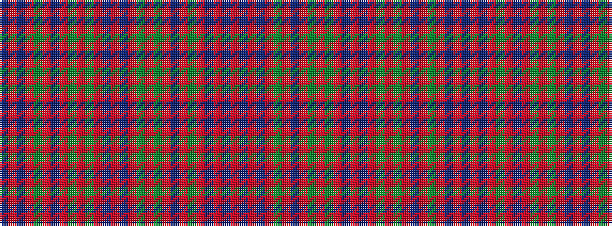

BRBRGRBRGRGRBRBRGRGRBRGRBRBR

It is a 28 stripe tartan.

<figure class="pat-woven">

<figcaption>idealised sample</figcaption>
</figure>

## Colour Sequence



## Tartans with this colour sequence

| Tartans |
|---------------|
| [Grant of Ballindalloch (Personal)](/variants/s28/r5db3r3g16r3g3r3db5r3y5r12db5r3db3r5~x4/)|
||
